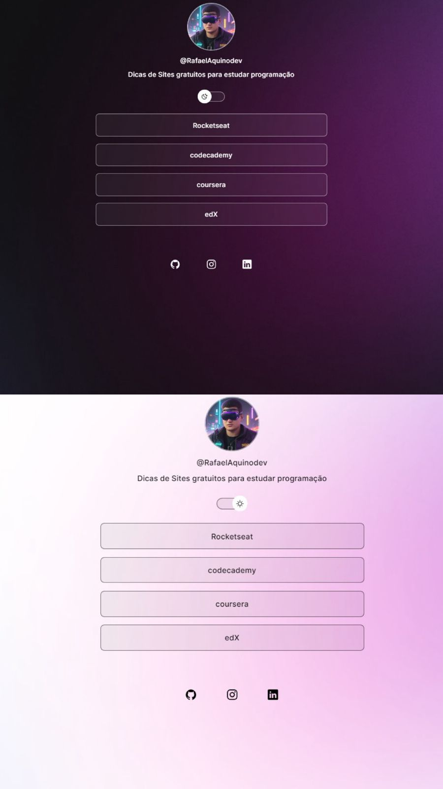

<h1 align="center"> DicasDev </h1>

Aplicação exclusiva para devs iniciantes que estão buscando sites gratuitos para estudar programação.  

  <a href="#-tecnologias">Tecnologias</a>&nbsp;&nbsp;&nbsp;|&nbsp;&nbsp;&nbsp;
  <a href="#-projeto">Projeto</a>&nbsp;&nbsp;&nbsp;|&nbsp;&nbsp;&nbsp;
  <a href="#-layout">Layout</a>&nbsp;&nbsp;&nbsp;|&nbsp;&nbsp;&nbsp;
  

 

  

## 🚀 Tecnologias

Esse projeto foi desenvolvido com as seguintes tecnologias:

- HTML e CSS
- JavaScript
- Git e Github

## 💻 Projeto

O DicasDev é um agregador de links para cursos gratuitos de programação.

- [Acesse o projeto finalizado, online](https://rafaelaquinodev.github.io/discover-dicas-site-programacao)

